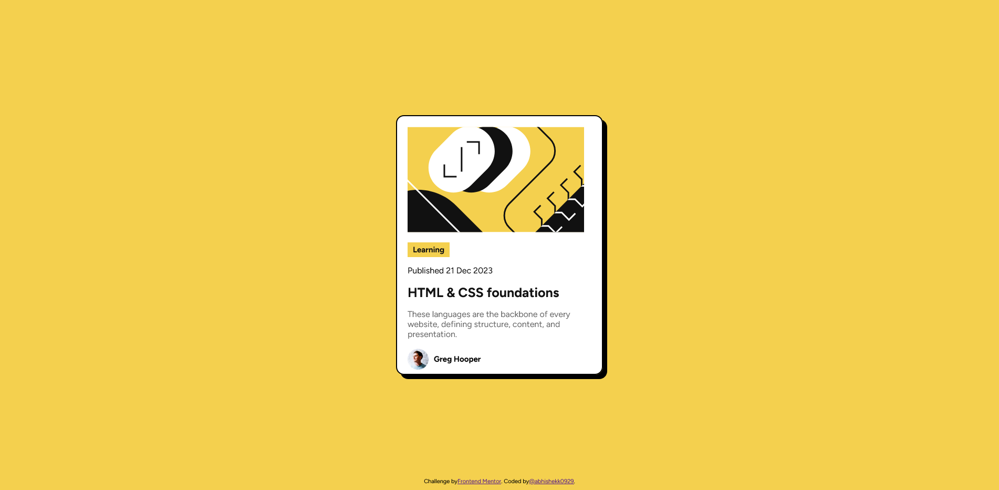

# 📰 Blog Preview Card

This is my solution to the [Blog Preview Card challenge on Frontend Mentor] https://www.frontendmentor.io/solutions/minimalist-blog-card-html-and-css-ui-component-voireNTTob.  
Live Demo:(https://abhishekk0929.github.io/blog-preview-card-main/)

---

## 📸 Screenshot

<!-- Replace with your actual screenshot file path if available -->

---

## 🔗 Links

- **Live Site:** [https://abhishekk0929.github.io/blog-preview-card-main/](https://abhishekk0929.github.io/blog-preview-card-main/)
- **Frontend Mentor Challenge:** [Blog Preview Card](https://www.frontendmentor.io/solutions/minimalist-blog-card-html-and-css-ui-component-voireNTTob))

---

## 🛠️ My Process

### 🧰 Built With

- Semantic HTML5 markup
- CSS custom properties
- Flexbox for layout and alignment
- Mobile-first workflow
- Responsive design with media queries

### 🚀 What I Learned

- Improved my understanding of semantic HTML for accessibility
- Practiced using Flexbox for card layouts and alignment
- Enhanced skills with custom CSS properties for colors and spacing
- Strengthened responsive design using media queries
- Added interactive hover and focus states for better user experience
- Used drop shadows for depth and visual appeal

---

## 📈 Continued Development

- Further explore advanced CSS Flexbox layouts
- Practice more with desktop media queries and browser compatibility
- Improve accessibility and ARIA usage

## 📚 Useful Resources

- [Frontend Mentor Help Center](https://www.frontendmentor.io/help)
- [CSS Tricks: A Complete Guide to Flexbox](https://css-tricks.com/snippets/css/a-guide-to-flexbox/)
- [MDN Web Docs: CSS Flexbox](https://developer.mozilla.org/en-US/docs/Web/CSS/CSS_flexbox)

## 👤 Author

- Frontend Mentor - [@abhishekk0929](https://www.frontendmentor.io/profile/abhishekk0929)

---

## 🙏 Acknowledgments

Thanks to the Frontend Mentor community for feedback and inspiration, and to everyone who shares helpful CSS and HTML resources online!

